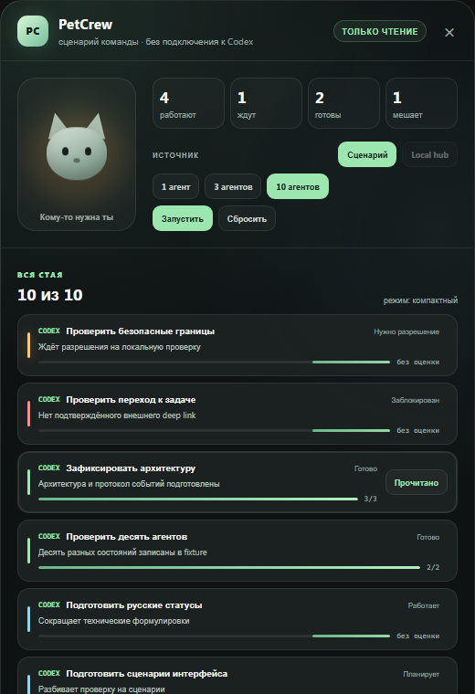

# PetCrew

PetCrew is a local Windows companion that shows what a team of Codex and
OpenCode agents is doing, which agents need attention, and which results are
still unread. It keeps prompts, tool payloads, transcripts, credentials, and
environment variables outside the UI and persisted state.



## What is implemented

- a compact React/Tauri Monitor with list and tile layouts, Russian UI, themes,
  text sizing, honest progress, and bulk acknowledgement of terminal results;
- a separately runnable headless PetCrew Core that owns local observation,
  retained state, authenticated snapshots, and SSE feeds;
- an inert repository-local Codex plugin with sanitized lifecycle hooks and an
  optional semantic status reporter;
- a dependency-free OpenCode adapter with deterministic terminal receipts;
- one provider-neutral event protocol and JSON Schema;
- loopback-only authenticated transport with a per-install secret;
- fixture-driven UI, Rust, Python, and Node test suites.

PetCrew observes activity. It does not approve tools, answer questions, submit
prompts, or bypass provider security boundaries.

## Repository map

```text
apps/overlay/       React Monitor and Tauri/Rust Core
adapters/opencode/  dependency-free OpenCode adapter
plugins/petcrew/    distributable Codex plugin source
shared/schemas/     provider-neutral event contract
tests/fixtures/     deterministic cross-component fixtures
docs/               product, architecture, protocol, and security truth
tools/              repository verification helpers
```

See [repository boundaries](docs/REPOSITORY_BOUNDARIES.md) for the exact
public-source and local-operations split.

## Development

Prerequisites:

- Windows;
- Node.js and npm compatible with `apps/overlay/package-lock.json`;
- stable Rust with Cargo;
- one normal Python 3 installation available as `python`.

Run every source-level check from the repository root:

```powershell
powershell -ExecutionPolicy Bypass -File .\tools\verify.ps1
```

Run the Monitor in development mode:

```powershell
Set-Location .\apps\overlay
npm ci
npm run tauri:dev
```

Build the canonical Windows Monitor candidate:

```powershell
Set-Location .\apps\overlay
npm run tauri:build
```

Do not use a direct `cargo build --release --bin petcrew` as the packaged
Monitor: it does not embed Tauri's production frontend protocol. The headless
`petcrew-core` binary remains a normal Rust binary.

Building source does not install provider adapters, change Codex/OpenCode
configuration, register scheduled tasks, or start background services. See
[installation](docs/INSTALLATION.md) before any live activation.

## Product rules

1. Show every real active or attention-requiring agent.
2. Use `current/total` only when both values come from an explicit plan or
   semantic status report.
3. Keep completed results visible until acknowledgement or an explicit
   retention rule.
4. Prefer short human-readable actions over raw implementation noise.
5. Keep the provider boundary replaceable and the transport local-only.

## Documentation

- [Документация для пользователя](docs/README.md)
- [Что такое PetCrew](docs/USER_GUIDE.md)
- [Как появляются новые котики](docs/ADDING_AGENTS.md)
- [Настройки](docs/SETTINGS.md)
- [Product specification](docs/PRODUCT_SPEC.md)
- [Architecture](docs/ARCHITECTURE.md)
- [Event protocol](docs/EVENT_PROTOCOL.md)
- [Security boundaries](docs/SECURITY.md)
- [Licensing](docs/LICENSING.md)
- [Installation and rollback](docs/INSTALLATION.md)
- [Windows alpha installer](docs/WINDOWS_ALPHA_INSTALLER.md)
- [Codex plugin contract](docs/CODEX_PLUGIN_CONTRACT.md)
- [OpenCode plugin contract](docs/OPENCODE_PLUGIN_CONTRACT.md)
- [Adding a provider](docs/NEW_PROVIDER_INTEGRATION.md)
- [Contributing](CONTRIBUTING.md)

## Status

The source-level verification baseline is 42 UI tests, 60 Rust tests, 12 Codex
bridge tests, and 24 OpenCode adapter tests, plus TypeScript and Vite production
builds. Live installation acceptance is intentionally tracked separately from
source correctness.

## License

PetCrew source is licensed under MIT. Third-party dependencies and tools keep
their own licenses. See [LICENSE](LICENSE), [Licensing](docs/LICENSING.md), and
[Third-party notices](THIRD_PARTY_NOTICES.md).
