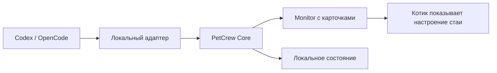

# Что такое PetCrew

PetCrew — локальный Windows-компаньон для работы с несколькими AI-агентами. Он
показывает не переписку, а состояние команды: кто работает, кто ждёт ответа или
разрешения, кто завершил задачу и чей результат ещё не прочитан.

Визуальный котик остаётся эмоциональным центром приложения. Карточки рядом с
ним отвечают за точность: провайдер, проект, задача, состояние, действие,
честный прогресс и короткий результат.

## Зачем он нужен

Когда одновременно работают несколько задач и субагентов, окна провайдеров
перестают давать цельную картину. PetCrew помогает за несколько секунд понять:

- сколько агентов сейчас работает;
- кому нужен ответ или разрешение;
- где появился новый непрочитанный результат;
- к какому проекту и провайдеру относится карточка;
- можно ли открыть соответствующую задачу или проект;
- какой прогресс подтверждён планом, а где точной оценки нет.

PetCrew не управляет агентами. Он не отправляет промпты, не отвечает на вопросы,
не одобряет права и не заменяет интерфейс Codex или OpenCode.

## Четыре разных сущности

| Сущность | Что это | Как появляется |
| --- | --- | --- |
| Питомец | Один визуальный котик, выражающий общее настроение команды | Встроен в Monitor |
| Агент | Одна корневая задача или субагент | Автоматически из событий провайдера |
| Проект | Контекст работы агента | Определяется адаптером; показывается только безопасное имя |
| Провайдер | Система, где работают агенты, например Codex или OpenCode | Подключается отдельным адаптером |

В разговоре агентов можно ласково называть «котиками», но в протоколе это
разные вещи: один питомец показывает настроение всей стаи, а каждый агент имеет
свою карточку.

## Как это устроено

1. Адаптер получает разрешённые структурные события провайдера.
2. Он удаляет приватные поля и отправляет событие в локальный Core.
3. Core проверяет протокол, хранит минимальное состояние и передаёт снимок
   Monitor.
4. Monitor сортирует карточки по вниманию и показывает актуальную стаю.

Обмен данными идёт только внутри компьютера. Промпты, рассуждения, команды,
аргументы инструментов, учётные данные и переменные окружения не должны
попадать в PetCrew.

## Что показывает карточка

- провайдер и безопасное имя проекта;
- название задачи;
- фазу: планирует, работает, ждёт ответа, ждёт разрешения, заблокирован,
  завершён, завершён с ошибкой или отменён;
- короткое текущее действие;
- время работы или завершения;
- прогресс, если провайдер передал настоящий `current/total`;
- число изменённых файлов и строк, если провайдер передал сводку изменений;
- короткий результат и отметку «прочитано» для терминальных карточек.

Активные, ожидающие внимания и непрочитанные терминальные карточки защищены от
скрытия. Настройка недавних результатов влияет только на уже прочитанный хвост.

## Обычный сценарий

1. Запустить Core и при необходимости открыть Monitor.
2. Начать задачи в подключённом Codex или OpenCode.
3. Следить за стаей, не переключаясь между всеми окнами.
4. Открывать нужную задачу из карточки, когда навигация поддерживается.
5. После чтения результата нажать `✓ Прочитано`, `Прочитать все` или
   `Прочитать субагентов`.

Кнопки чтения меняют только локальную отметку результата. Они не останавливают
задачу и ничего не отправляют провайдеру.

## Что пока не реализовано

- выбор и установка нескольких визуальных питомцев через UI;
- отдельный котик на каждого агента;
- звуки и уведомления;
- фильтры по проектам и провайдерам;
- управление агентами из Monitor;
- публичный установщик и автоматическое обновление.

Подключение новых агентов и визуальных котиков разобрано отдельно в
[ADDING_AGENTS.md](ADDING_AGENTS.md).
